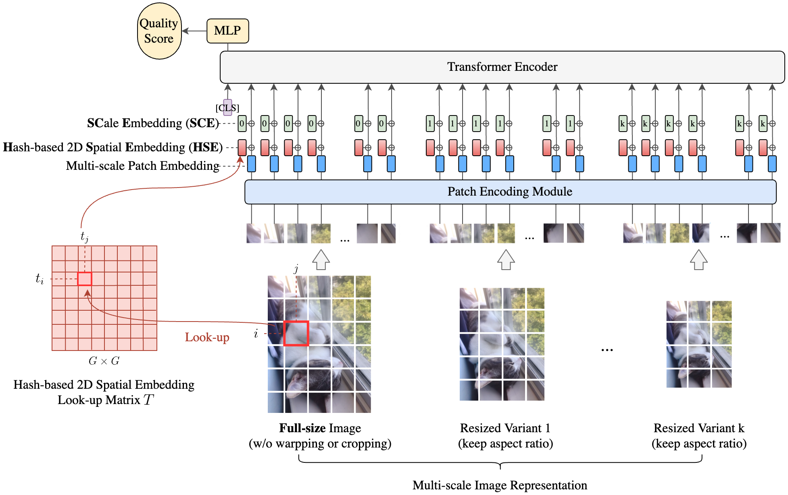

# MUSIQ: Multi-scale Image Quality Transformer

## MUSIQ unofficial Google product.

https://github.com/google-research/google-research/tree/master/musiq

https://tfhub.dev/google/musiq/spaq/1

https://colab.research.google.com/github/google-research/google-research/blob/master/musiq/Inference_with_MUSIQ.ipynb

Input

A JPEG/PNG image bytes, no decoding is needed.

Output

A score range in [0, 100]

```
import tensorflow_hub as hub

image_bytes = load_image("my_image.jpeg")
model = hub.load('https://tfhub.dev/google/musiq/spaq/1')
predict_fn = model.signatures['serving_default']

aesthetic_score = predict_fn(tf.constant(image_bytes))
```

## NIMA: Neural Image Assessment

https://ai.googleblog.com/2017/12/introducing-nima-neural-image-assessment.html

https://github.com/idealo/image-quality-assessment/blob/master/contrib/tf_serving/tfs_sample_client.py

https://github.com/idealo/image-quality-assessment

https://www.w3resource.com/numpy/array-creation/arange.php

https://www.tensorflow.org/lite/guide/inference?hl=zh-cn

## Unofficial **pytorch** implementation of the paper "MUSIQ: Multi-Scale Image Quality Transformer" (paper link: https://arxiv.org/abs/2108.05997)

https://github.com/anse3832/MUSIQ

This directory contains checkpoints and model inference code for the ICCV 2021
paper:
["MUSIQ: Multi-scale Image Quality Transformer"](https://arxiv.org/abs/2108.05997)
by Junjie Ke, Qifei Wang, Yilin Wang, Peyman Milanfar, Feng Yang.

*Disclaimer: This is not an official Google product.*



## Build TensorFlow Lite for iOS

https://www.tensorflow.org/lite/guide/build_ios

## Using the models

The MUSIQ models are available on [TensorFlow Hub](https://tfhub.dev/s?q=musiq)
with documentation and a sample notebook for you to try.

But if you want to go deeper in the code, follow the instructions below.

## Pre-requisite

Install dependencies:

```
pip3 install -r requirements.txt
```

The model checkpoints can be downloaded from:
[download link](https://console.cloud.google.com/storage/browser/gresearch/musiq)

The folder contains the following checkpoints:

-   **ava_ckpt.npz**: Trained on AVA dataset.
-   **koniq_ckpt.npz**: Trained on KonIQ dataset.
-   **paq2piq_ckpt.npz**: Trained on PaQ2PiQ dataset.
-   **spaq_ckpt.npz**: Trained on SPAQ dataset.
-   **imagenet_pretrain.npz**: Pretrained checkpoint on ImageNet.

## Run Inference

npz types: 
`musiq-ava_ckpt.npz` `musiq-imagenet_pretrain.npz` 
`musiq-koniq_ckpt.npz` `musiq-paq2piq_ckpt.npz` `musiq-spaq_ckpt.npz`

```
% python3 -m musiq.run_predict_image \
  --ckpt_path=/Users/gavinxiang/Downloads/Tensorflow-Exercise/musiq/tmp/musiq-spaq_ckpt.npz \
  --image_path=/Users/gavinxiang/Downloads/Tensorflow-Exercise/musiq/tmp/image.jpeg
```

```
(base) ➜  Tensorflow-Exercise git:(main) ✗ pwd
/Users/gavinxiang/Downloads/Tensorflow-Exercise

(base) ➜  Tensorflow-Exercise git:(main) ✗ python3 -m musiq.run_predict_image \
  --ckpt_path=/Users/gavinxiang/Downloads/Tensorflow-Exercise/musiq/tmp/musiq-spaq_ckpt.npz \
  --image_path=/Users/gavinxiang/Downloads/Tensorflow-Exercise/musiq/tmp/image9.png
  
WARNING:tensorflow:From /Users/gavinxiang/Downloads/Tensorflow-Exercise/musiq/run_predict_image.py:160: FastGFile.__init__ (from tensorflow.python.platform.gfile) is deprecated and will be removed in a future version.
Instructions for updating:
Use tf.gfile.GFile.
W0420 13:53:23.824407 8055423232 deprecation.py:364] From /Users/gavinxiang/Downloads/Tensorflow-Exercise/musiq/run_predict_image.py:160: FastGFile.__init__ (from tensorflow.python.platform.gfile) is deprecated and will be removed in a future version.
Instructions for updating:
Use tf.gfile.GFile.
Metal device set to: Apple M1 Pro

systemMemory: 16.00 GB
maxCacheSize: 5.33 GB

/Users/gavinxiang/miniconda3/lib/python3.10/site-packages/flax/nn/base.py:273: DeprecationWarning: The `flax.nn` module is Deprecated, use `flax.linen` instead. Learn more and find an upgrade guide at https://github.com/google/flax/blob/master/flax/linen/README.md
  warnings.warn("The `flax.nn` module is Deprecated, use `flax.linen` instead. Learn more and find an upgrade guide at https://github.com/google/flax/blob/master/flax/linen/README.md", DeprecationWarning)
I0420 13:53:24.334821 8055423232 xla_bridge.py:440] Unable to initialize backend 'cuda': module 'jaxlib.xla_extension' has no attribute 'GpuAllocatorConfig'
I0420 13:53:24.334903 8055423232 xla_bridge.py:440] Unable to initialize backend 'rocm': module 'jaxlib.xla_extension' has no attribute 'GpuAllocatorConfig'
I0420 13:53:24.335033 8055423232 xla_bridge.py:440] Unable to initialize backend 'tpu': module 'jaxlib.xla_extension' has no attribute 'get_tpu_client'
I0420 13:53:24.335073 8055423232 xla_bridge.py:440] Unable to initialize backend 'plugin': xla_extension has no attributes named get_plugin_device_client. Compile TensorFlow with //tensorflow/compiler/xla/python:enable_plugin_device set to true (defaults to false) to enable this.
============== Precited MOS: 73.05229
```

## Colab

https://tfhub.dev/google/musiq/spaq/1

https://colab.research.google.com/github/google-research/google-research/blob/master/musiq/Inference_with_MUSIQ.ipynb

selected_model: spaq

image_url:

https://blogger.googleusercontent.com/img/b/R29vZ2xl/AVvXsEgr0DKaAoO6qTrJo3hXP8UM3D4AB8gQeNI22Q2QphBVGgn-5v84tjhH3ZWTlGtlUoPdlcx54dM93Qi04MuN7eBbj9WlT8Qxy6B2Us4kcn_53FH28MnTtGCzMPhjCVGIgXRL8ZEMeO-7iue7sNEGxBtgx2bI-eKDQAondM8Dfjb1FaybFgUQji4UU9-0vQ/s1024/image9.png

predicted MOS:  {'output_0': <tf.Tensor: shape=(), dtype=float32, numpy=73.052315>}

## Citation

If you find this code is useful for your publication, please cite the original
paper:

```
@inproceedings{jke_musiq_iccv2021,
  title = {MUSIQ: Multi-scale Image Quality Transformer},
  author = {Junjie Ke and Qifei Wang and Yilin Wang and Peyman Milanfar and Feng Yang},
  booktitle = {ICCV},
  year = {2021}
}
```

## Numpy 拓展库 (.npz)

https://m.imooc.com/wiki/tensorflow-tensorflowloadnumpy

Numpy 是 Python 的一个扩展库。支持高阶维度数组的复杂运算以及矩阵的运算。因此在进行科学计算的时候使用 Numpy 进行数据处理便会特别的方便。

在具体的使用过程之中，我们一般会遇到两种情况：

在内存中定义了 Numpy 数组，需要提供给 TesnorFlow 使用；

我们需要加载 Numpy 存放的文件的数据，也就是需要从“.npz”文件之中读取数据。

## 使用自定义 TensorFlow Lite 模型（Apple 平台）

如果模型是您自己构建的，或者模型的输入和输出格式有文档说明，那么您可能已经知道这些信息。如果您不知道模型输入和输出的形状和数据类型，可以使用 **TensorFlow Lite 解释器检查模型**。例如：

python-tools/inspect_tflite.py

```
import tensorflow as tf

interpreter = tf.lite.Interpreter(model_path="your_model.tflite")
interpreter.allocate_tensors()

# Print input shape and type
inputs = interpreter.get_input_details()
print('{} input(s):'.format(len(inputs)))
for i in range(0, len(inputs)):
    print('{} {}'.format(inputs[i]['shape'], inputs[i]['dtype']))

# Print output shape and type
outputs = interpreter.get_output_details()
print('\n{} output(s):'.format(len(outputs)))
for i in range(0, len(outputs)):
    print('{} {}'.format(outputs[i]['shape'], outputs[i]['dtype']))
```

Correct One:
```
1 input(s):
[  1 224 224   3] <class 'numpy.float32'>

1 output(s):
[1 1000] <class 'numpy.float32'>
```

~Wrong One with zero bytecount input and output:~
```
(base) ➜  spaq git:(main) ✗ python3 inspect_tflite.py 
INFO: Created TensorFlow Lite delegate for select TF ops.
Metal device set to: Apple M1 Pro

systemMemory: 16.00 GB
maxCacheSize: 5.33 GB

INFO: TfLiteFlexDelegate delegate: 34 nodes delegated out of 1181 nodes with 3 partitions.

INFO: Created TensorFlow Lite XNNPACK delegate for CPU.
1 input(s):
[] <class 'numpy.bytes_'>

1 output(s):
[] <class 'numpy.float32'>
```

https://stackoverflow.com/questions/52287141/tf-lite-prelu-works-incorrectly-after-converting-pb-model-to-tflite

Then using tf 2.9.1 with `tf.compat.v1.lite.TFLiteConverter` and set `converter.experimental_new_converter = False`

After conversion the prelu display correctly in netron. check tflite visualized by netron.

https://i.stack.imgur.com/Txd7p.png

```
(base) ➜  koniq git:(main) ✗ python3 convert_pb_to_tflite.py
<unknown>:0: error: failed while converting: 'main': 
Some ops in the model are custom ops, See instructions to implement custom ops: https://www.tensorflow.org/lite/guide/ops_custom 
Custom ops: ScaleAndTranslate, XlaDotV2, XlaReduceWindow
```

https://www.tensorflow.org/lite/guide/ops_custom 

`converter.allow_custom_ops = True`

```
(base) ➜  koniq git:(main) ✗ python3 convert_pb_to_tflite.py
Metal device set to: Apple M1 Pro

systemMemory: 16.00 GB
maxCacheSize: 5.33 GB

2023-04-18 17:43:18.238417: W tensorflow/compiler/mlir/lite/python/tf_tfl_flatbuffer_helpers.cc:364] Ignored output_format.
2023-04-18 17:43:18.238462: W tensorflow/compiler/mlir/lite/python/tf_tfl_flatbuffer_helpers.cc:367] Ignored drop_control_dependency.
2023-04-18 17:43:18.513784: W tensorflow/tsl/platform/profile_utils/cpu_utils.cc:128] Failed to get CPU frequency: 0 Hz
2023-04-18 17:43:20.984880: W tensorflow/compiler/mlir/lite/flatbuffer_export.cc:2051] TFLite interpreter needs to link Flex delegate in order to run the model since it contains the following Select TFop(s):
Flex ops: FlexCast, FlexCeil, FlexDecodeJpeg, FlexExtractImagePatches, FlexRealDiv, FlexResizeNearestNeighbor
Details:
    tf.Cast(tensor<f64>) -> (tensor<i32>) : {Truncate = false, device = ""}
    tf.Cast(tensor<i32>) -> (tensor<f64>) : {Truncate = false, device = ""}
    tf.Ceil(tensor<f64>) -> (tensor<f64>) : {device = ""}
    tf.DecodeJpeg(tensor<!tf_type.string>) -> (tensor<?x?x?xui8>) : {acceptable_fraction = 1.000000e+00 : f32, channels = 0 : i64, dct_method = "", device = "", fancy_upscaling = true, ratio = 1 : i64, try_recover_truncated = false}
    tf.ExtractImagePatches(tensor<1x?x?x?xf32>) -> (tensor<1x?x?x?xf32>) : {device = "", ksizes = [1, 32, 32, 1], padding = "SAME", rates = [1, 1, 1, 1], strides = [1, 32, 32, 1]}
    tf.RealDiv(tensor<f64>, tensor<f64>) -> (tensor<f64>) : {device = ""}
    tf.ResizeNearestNeighbor(tensor<1x10x1x1xi32>, tensor<2xi32>) -> (tensor<1x?x?x1xi32>) : {align_corners = false, device = "", half_pixel_centers = false}
See instructions: https://www.tensorflow.org/lite/guide/ops_select
2023-04-18 17:43:20.985000: W tensorflow/compiler/mlir/lite/flatbuffer_export.cc:2062] The following operation(s) need TFLite custom op implementation(s):
Custom ops: ScaleAndTranslate, XlaDotV2, XlaReduceWindow
Details:
    tf.ScaleAndTranslate(tensor<1x?x?x?xf32>, tensor<2xi32>, tensor<2xf32>, tensor<2xf32>) -> (tensor<1x?x?x?xf32>) : {T = f32, antialias = false, device = "", kernel_type = "gaussian"}
    tf.XlaDotV2(tensor<1x1217x16384xf32>, tensor<16384x384xf32>) -> (tensor<1x1217x384xf32>) : {device = "", dimension_numbers = "\0A\01\02\12\01\00", precision_config = ""}
    tf.XlaDotV2(tensor<1x1218x1152xf32>, tensor<1152x384xf32>) -> (tensor<1x1218x384xf32>) : {device = "", dimension_numbers = "\0A\01\02\12\01\00", precision_config = ""}
    tf.XlaDotV2(tensor<1x1218x384xf32>, tensor<384x1152xf32>) -> (tensor<1x1218x1152xf32>) : {device = "", dimension_numbers = "\0A\01\02\12\01\00", precision_config = ""}
    tf.XlaDotV2(tensor<1x1218x384xf32>, tensor<384x6x64xf32>) -> (tensor<1x1218x6x64xf32>) : {device = "", dimension_numbers = "\0A\01\02\12\01\00", precision_config = ""}
    tf.XlaDotV2(tensor<1x1218x6x64xf32>, tensor<6x64x384xf32>) -> (tensor<1x1218x384xf32>) : {device = "", dimension_numbers = "\0A\02\02\03\12\02\00\01", precision_config = ""}
    tf.XlaDotV2(tensor<1x384xf32>, tensor<384x1xf32>) -> (tensor<1x1xf32>) : {device = "", dimension_numbers = "\0A\01\01\12\01\00", precision_config = ""}
    tf.XlaDotV2(tensor<1x6x1218x1218xf32>, tensor<1x6x64x1218xf32>) -> (tensor<1x6x1218x64xf32>) : {device = "", dimension_numbers = "\0A\01\03\12\01\03\1A\02\00\01\22\02\00\01", precision_config = ""}
    tf.XlaDotV2(tensor<1x6x1218x64xf32>, tensor<1x6x1218x64xf32>) -> (tensor<1x6x1218x1218xf32>) : {device = "", dimension_numbers = "\0A\01\03\12\01\03\1A\02\00\01\22\02\00\01", precision_config = ""}
    tf.XlaReduceWindow(tensor<1217x16x16x64xf32>, tensor<f32>, tensor<4xi32>, tensor<4xi32>, tensor<4xi32>, tensor<4xi32>, tensor<4x2xi32>) -> (tensor<1217x8x8x64xf32>) : {computation = @__inference_function_7480, device = ""}
See instructions: https://www.tensorflow.org/lite/guide/ops_custom
```

https://github.com/tensorflow/tensorflow/issues/33490

```
converter.optimizations = [tf.lite.Optimize.OPTIMIZE_FOR_SIZE]
converter.target_spec.supported_ops = [tf.lite.OpsSet.TFLITE_BUILTINS, tf.lite.OpsSet.SELECT_TF_OPS]
converter.allow_custom_ops=True
tflite_model = converter.convert()
```

https://github.com/tensorflow/tensorflow/issues/37134

https://stackoverflow.com/questions/65876823/converting-model-to-tflite-with-select-tf-ops-cannot-convert-ops-hashtablev2-o

https://stackoverflow.com/questions/66175147/convert-pb-to-tflite-for-a-model-of-variable-input-shape

`tf.saved_model.load` returns a SavedModel, but `tf.lite.TFLiteConverter.from_keras_model` expects a Keras model so it couldn't handle it.

You need to use the `TFLiteConverter.from_saved_model` API. Something like this:
```
saved_model_dir = '/content/drive/MyDrive/FINAL DNET MODEL/inference_graph/saved_model/'
converter = tf.lite.TFLiteConverter.from_saved_model(saved_model_dir)
```

https://github.com/tensorflow/tensorflow/issues/48482

https://github.com/tensorflow/tensorflow/commit/904b3926ed1c6c70380d5313d282d248a776baa1

```
converter._experimental_lower_tensor_list_ops = True
```

如果您的应用使用自定义 TensorFlow Lite 模型，您可以使用 Firebase ML 部署模型。使用 Firebase 来部署模型，您可以缩减应用的初始下载大小，而且无需发布应用的新版本即可更新应用的机器学习模型。此外，借助 Remote Config 和 A/B Testing，您可以为不同的用户组动态提供不同的模型。

无论您以何种方式在 Firebase ML 中添加自己的 TensorFlow Lite 模型，Firebase ML 都会以标准序列化的 protobuf 格式将所有模型存储到本地存储空间中。

- Firebase ML 模型的安全性

**从理论上说，这意味着任何人都可以复制您的模型。但实际上，大多数模型都是针对具体的应用，且通过优化进行了混淆处理，因此，这一风险与竞争对手对您的代码进行反汇编和再利用的风险类似。** 但无论怎样，在您的应用中使用自定义模型之前，您应该了解这种风险。

https://firebase.google.com/docs/ml/ios/use-custom-models?hl=zh-cn

https://firebase.google.com/docs/ml/manage-hosted-models?hl=zh-cn

# iOS Demo
## Select TensorFlow op(s), included in the given model, is(are) not supported by this interpreter.
```
2023-04-18 11:09:18.315345+0800 MUSIQ-Demo[2245:652100] Created TensorFlow Lite delegate for Metal.
INFO: Created TensorFlow Lite delegate for Metal.
2023-04-18 11:09:18.315941+0800 MUSIQ-Demo[2245:652100] Metal GPU Frame Capture Enabled
2023-04-18 11:09:18.316234+0800 MUSIQ-Demo[2245:652100] Metal API Validation Enabled
2023-04-18 11:09:18.389871+0800 MUSIQ-Demo[2245:652098] Initialized TensorFlow Lite runtime.
INFO: Initialized TensorFlow Lite runtime.
2023-04-18 11:09:18.412654+0800 MUSIQ-Demo[2245:652101] Select TensorFlow op(s), included in the given model, is(are) not supported by this interpreter. Make sure you apply/link the Flex delegate before inference. For the Android, it can be resolved by adding "org.tensorflow:tensorflow-lite-select-tf-ops" dependency. See instructions: https://www.tensorflow.org/lite/guide/ops_select
ERROR: Select TensorFlow op(s), included in the given model, is(are) not supported by this interpreter. Make sure you apply/link the Flex delegate before inference. For the Android, it can be resolved by adding "org.tensorflow:tensorflow-lite-select-tf-ops" dependency. See instructions: https://www.tensorflow.org/lite/guide/ops_select
2023-04-18 11:09:18.412768+0800 MUSIQ-Demo[2245:652101] Node number 0 (FlexDecodeJpeg) failed to prepare.
ERROR: Node number 0 (FlexDecodeJpeg) failed to prepare.
Failed to create the interpreter with error: Failed to allocate memory for input tensors.
Failed to initialize: internalError(Failed to allocate memory for input tensors.)
```

```
# In your Podfile target:
  pod 'TensorFlowLiteSwift'   # or 'TensorFlowLiteObjC'
  pod 'TensorFlowLiteSelectTfOps', '~> 0.0.1-nightly'
```

After running pod install, you need to provide an additional linker flag to force load the select TF ops framework into your project. In your Xcode project, go to Build Settings -> Other Linker Flags, and add:

For versions >= 2.9.0:

```
-force_load $(SRCROOT)/Pods/TensorFlowLiteSelectTfOps/Frameworks/TensorFlowLiteSelectTfOps.xcframework/ios-arm64/TensorFlowLiteSelectTfOps.framework/TensorFlowLiteSelectTfOps
```

For versions < 2.9.0:

```
-force_load $(SRCROOT)/Pods/TensorFlowLiteSelectTfOps/Frameworks/TensorFlowLiteSelectTfOps.framework/TensorFlowLiteSelectTfOps
```

**You should then be able to run any models converted with the SELECT_TF_OPS in your iOS app. For example, you can modify the [Image Classification iOS app](https://github.com/tensorflow/examples/tree/master/lite/examples/image_classification/ios) to test the select TF ops feature.**

https://www.tensorflow.org/lite/guide/ops_select

https://stackoverflow.com/questions/72311274/ios-tensorflow-lite-error-select-tensorflow-ops-included-in-the-given-mode

**Note: If you need to use select TF ops in an x86_64 simulator, you can build the select ops framework yourself. See Using [Bazel + Xcode](https://www.tensorflow.org/lite/guide/ops_select#using_bazel_xcode) section for more details.**

## Undefined symbols for architecture arm64:
```
  "tensorflow::MemoryDump::MemoryDump(google::protobuf::Arena*, bool)", referenced from:
      tsl::BFCAllocator::RecordMemoryMapInternal() in TensorFlowLiteSelectTfOps(bfc_allocator_0b56374a630e47938a541b3a1bc43692.o)
  "tensorflow::MemoryDump::~MemoryDump()", referenced from:
      tsl::BFCAllocator::MaybeWriteMemoryMap() in TensorFlowLiteSelectTfOps(bfc_allocator_0b56374a630e47938a541b3a1bc43692.o)
  "tensorflow::RPCOptions::MergeImpl(google::protobuf::Message&, google::protobuf::Message const&)", referenced from:
      tensorflow::ConfigProto::MergeImpl(google::protobuf::Message&, google::protobuf::Message const&) in TensorFlowLiteSelectTfOps(config.pb.o)
```

https://github.com/tensorflow/tensorflow/issues/56255

Hi, you just need to update your pod file to depend on the latest nightly build version.

```
target 'my-app' do
  use_frameworks!

  # Pods for my-app
  pod 'TensorFlowLiteSwift', '~> 0.0.1-nightly'
  pod 'TensorFlowLiteSelectTfOps', '~> 0.0.1-nightly'
end
```

run `pod update --verbose` and `pod install`

## [GPU] Failed to initialize: internalError(Failed to create the interpreter.)

```
2023-04-18 12:39:14.969942+0800 MUSIQ-Demo[2313:680761] Created TensorFlow Lite delegate for Metal.
INFO: Created TensorFlow Lite delegate for Metal.
2023-04-18 12:39:14.970584+0800 MUSIQ-Demo[2313:680765] Metal GPU Frame Capture Enabled
2023-04-18 12:39:14.971035+0800 MUSIQ-Demo[2313:680765] Metal API Validation Enabled
2023-04-18 12:39:15.051938+0800 MUSIQ-Demo[2313:680765] Initialized TensorFlow Lite runtime.
INFO: Initialized TensorFlow Lite runtime.
2023-04-18 12:39:15.056765+0800 MUSIQ-Demo[2313:680757] Created TensorFlow Lite delegate for select TF ops.
INFO: Created TensorFlow Lite delegate for select TF ops.
2023-04-18 12:39:15.064499+0800 MUSIQ-Demo[2313:680761] TfLiteFlexDelegate delegate: 34 nodes delegated out of 1181 nodes with 3 partitions.
INFO: TfLiteFlexDelegate delegate: 34 nodes delegated out of 1181 nodes with 3 partitions.

Failed to create the interpreter with error: Failed to create the interpreter.
[CPU] Success to initialize: MUSIQ_Demo.MUSIQTransferer
[GPU] Failed to initialize: internalError(Failed to create the interpreter.)
```

```
let createOptions: () -> Interpreter.Options? = {
    if useMetalDelegate {
        return nil
    }
    var options = Interpreter.Options()
    options.threadCount = ProcessInfo.processInfo.processorCount >= 2 ? 2 : 1
    return options
}

do {
    // Create the `Interpreter`s.
    let predictInterpreter = try Interpreter(
        modelPath: predictModelPath,
        options: createOptions(),
        delegates: createDelegates()
    )
} catch let error {
}
```

## Failed to invoke the interpreter with error: Provided data count 786432 must match the required count 0.

```
    // Copy the RGB data to the input `Tensor`.
    try self.predictInterpreter.copy(styleRGBData, toInputAt: 0)
```

```
    let byteCount = TfLiteTensorByteSize(cTensor)
    guard data.count == byteCount else {
      throw InterpreterError.invalidTensorDataCount(provided: data.count, required: byteCount)
    }
```

It seems the problem is with input buffer size.

https://github.com/tensorflow/tensorflow/issues/35864

https://stackoverflow.com/questions/63842275/tensorflow-interpreter-throwing-error-for-data-count-ios

## Thread 2: EXC_BAD_ACCESS (code=1, address=0x0)

```
// Run inference by invoking the `Interpreter`.
try self.predictInterpreter.invoke()
```

```
[CPU] Success to initialize: MUSIQ_Demo.MUSIQTransferer
[GPU] Failed to initialize: internalError(Failed to create the interpreter.)
2023-04-18 12:51:28.520108+0800 MUSIQ-Demo[2324:685191] invalid mode 'kCFRunLoopCommonModes' provided to CFRunLoopRunSpecific - break on _CFRunLoopError_RunCalledWithInvalidMode to debug. This message will only appear once per execution.
```

## After custom Tensorflow Task for MUSIQ, below are compile issues below:
```
Undefined symbols for architecture arm64:
  "_TfLiteMUSIQTransformWithRoi", referenced from:
      -[TFLMUSIQTransformer transformWithGMLImage:regionOfInterest:error:] in TFLMUSIQTransformer.o
  "_TfLiteMUSIQTransformerDelete", referenced from:
      -[TFLMUSIQTransformer dealloc] in TFLMUSIQTransformer.o
  "_TfLiteMUSIQTransformerFromOptions", referenced from:
      +[TFLMUSIQTransformer transformWithOptions:error:] in TFLMUSIQTransformer.o
  "_TfLiteMUSIQTransformerOptionsCreate", referenced from:
      +[TFLMUSIQTransformer transformWithOptions:error:] in TFLMUSIQTransformer.o
ld: symbol(s) not found for architecture arm64
clang: error: linker command failed with exit code 1 (use -v to see invocation)
```

https://www.tensorflow.org/lite/api_docs/java/org/tensorflow/lite/task/core/vision/ImageProcessingOptions.Builder

Sets the region of interest (ROI) of the image. Defaults to the entire image.

## Must call allocateTensors()
```
    //test
    try self.predictInterpreter.allocateTensors()
    
    // Copy the RGB data to the input `Tensor`.
//                try self.predictInterpreter.copy(styleRGBData, toInputAt: 0)
    //test
    let inputTensor = try self.predictInterpreter.input(at: 0)
    let byteCount = inputTensor.data.count
    try self.predictInterpreter.copy(inputRGBData, toInputAt: 0)
```

```
2023-04-18 16:50:57.715603+0800 MUSIQ-Demo[2480:760027] invalid mode 'kCFRunLoopCommonModes' provided to CFRunLoopRunSpecific - break on _CFRunLoopError_RunCalledWithInvalidMode to debug. This message will only appear once per execution.
Failed to invoke the interpreter with error: Must call allocateTensors().
```

modified:

```
    // Copy the RGB data to the input `Tensor`.
//                try self.predictInterpreter.copy(styleRGBData, toInputAt: 0)
    //test
    try self.predictInterpreter.copy(inputRGBData, toInputAt: 0)
    let inputTensor = try self.predictInterpreter.input(at: 0)
    let byteCount = inputTensor.data.count
```

## input shapes

https://www.tensorflow.org/lite/guide/inference?hl=zh-cn

https://discuss.tensorflow.org/t/custom-transfer-learning-tensorflowlite-model-gives-error-in-android-code-for-image-classification/1010/3

https://blog.csdn.net/oMoDao1/article/details/82079591

set_shape()和reshape()的区别

这两个主要是适用场合的区别，前者用于更新图中某个tensor的shape，而后者则往往用于动态地创建一个新的tensor

```
(base) ➜  python-tools git:(main) ✗ python3 modify_pb_input_shape.py
Metal device set to: Apple M1 Pro

systemMemory: 16.00 GB
maxCacheSize: 5.33 GB

Traceback (most recent call last):
  File "/Users/gavinxiang/miniconda3/lib/python3.10/site-packages/tensorflow/python/framework/ops.py", line 827, in set_shape
    pywrap_tf_session.TF_GraphSetTensorShape_wrapper(
tensorflow.python.framework.errors_impl.InvalidArgumentError: Shapes must be equal rank, but are 0 and 1

During handling of the above exception, another exception occurred:

Traceback (most recent call last):
  File "/Users/gavinxiang/Downloads/Tensorflow-Exercise/python-tools/modify_pb_input_shape.py", line 5, in <module>
    concrete_func.inputs[0].set_shape([1])
  File "/Users/gavinxiang/miniconda3/lib/python3.10/site-packages/tensorflow/python/framework/ops.py", line 831, in set_shape
    raise ValueError(e.message)
ValueError: Shapes must be equal rank, but are 0 and 1

```

```
(base) ➜  python-tools git:(main) ✗ python3 modify_pb_input_shape.py
Metal device set to: Apple M1 Pro

systemMemory: 16.00 GB
maxCacheSize: 5.33 GB

Traceback (most recent call last):
  File "/Users/gavinxiang/Downloads/Tensorflow-Exercise/python-tools/modify_pb_input_shape.py", line 6, in <module>
    tf.reshape(concrete_func.inputs[0], [1])
  File "/Users/gavinxiang/miniconda3/lib/python3.10/site-packages/tensorflow/python/util/traceback_utils.py", line 153, in error_handler
    raise e.with_traceback(filtered_tb) from None
  File "/Users/gavinxiang/miniconda3/lib/python3.10/site-packages/tensorflow/python/eager/execute.py", line 52, in quick_execute
    tensors = pywrap_tfe.TFE_Py_Execute(ctx._handle, device_name, op_name,
TypeError: <tf.Tensor 'image_bytes_tensor:0' shape=() dtype=string> is out of scope and cannot be used here. Use return values, explicit Python locals or TensorFlow collections to access it.
Please see https://www.tensorflow.org/guide/function#all_outputs_of_a_tffunction_must_be_return_values for more information.

<tf.Tensor 'image_bytes_tensor:0' shape=() dtype=string> was defined here:
<unknown>

The tensor <tf.Tensor 'image_bytes_tensor:0' shape=() dtype=string> cannot be accessed from here, because it was defined in FuncGraph(name=signature_wrapper, id=12939710704), which is out of scope.
```

https://www.tensorflow.org/guide/tensor

https://www.tensorflow.org/swift/tutorials/a_swift_tour

```
// TensorFlowLiteSwift/Core/Interpreter.swift

  /// Allocates memory for all input `Tensor`s based on their `Tensor.Shape`s.
  ///
  /// - Note: This is a relatively expensive operation and should only be called after creating the
  ///     interpreter and resizing any input tensors.
  /// - Throws: An error if memory could not be allocated for the input tensors.
  public func allocateTensors() throws {
    guard TfLiteInterpreterAllocateTensors(cInterpreter) == kTfLiteOk else {
      throw InterpreterError.failedToAllocateTensors
    }
  }
```

## options.isXNNPackEnabled

https://www.tensorflow.org/lite/api_docs/swift/Classes/Interpreter/Options

```
let createOptions: () -> Interpreter.Options? = {
    if useMetalDelegate {
        return nil
    }
    var options = Interpreter.Options()
    options.threadCount = ProcessInfo.processInfo.processorCount >= 2 ? 2 : 1
    options.isXNNPackEnabled =  true
    return options
}
```
```
2023-04-19 13:25:56.163308+0800 MUSIQ-Demo[2859:903397] Created TensorFlow Lite delegate for Metal.
INFO: Created TensorFlow Lite delegate for Metal.
2023-04-19 13:25:56.163783+0800 MUSIQ-Demo[2859:903397] Metal GPU Frame Capture Enabled
2023-04-19 13:25:56.164864+0800 MUSIQ-Demo[2859:903397] Metal API Validation Enabled
2023-04-19 13:25:56.165869+0800 MUSIQ-Demo[2859:903396] Created TensorFlow Lite XNNPACK delegate for CPU.
INFO: Created TensorFlow Lite XNNPACK delegate for CPU.
2023-04-19 13:25:56.167535+0800 MUSIQ-Demo[2859:903404] Initialized TensorFlow Lite runtime.
INFO: Initialized TensorFlow Lite runtime.
2023-04-19 13:25:56.170954+0800 MUSIQ-Demo[2859:903396] Created TensorFlow Lite delegate for select TF ops.
INFO: Created TensorFlow Lite delegate for select TF ops.
2023-04-19 13:25:56.224584+0800 MUSIQ-Demo[2859:903396] TfLiteFlexDelegate delegate: 34 nodes delegated out of 1181 nodes with 3 partitions.
INFO: TfLiteFlexDelegate delegate: 34 nodes delegated out of 1181 nodes with 3 partitions.

Failed to create the interpreter with error: Failed to create the interpreter.
Failed to create the interpreter with error: Failed to create the interpreter.
[CPU] Failed to initialize: internalError(Failed to create the interpreter.)
[GPU] Failed to initialize: internalError(Failed to create the interpreter.)

```

```
  // TensorFlowLiteSwift/Core/Interpreter.swift
    
  /// Copies the given data to the input `Tensor` at the given index.
  ///
  /// - Parameters:
  ///   - data: The data to be copied to the input `Tensor`'s data buffer.
  ///   - index: The index for the input `Tensor`.
  /// - Throws: An error if the `data.count` does not match the input tensor's `data.count` or if
  ///     the given index is invalid.
  /// - Returns: The input `Tensor` with the copied data.
  @discardableResult
  public func copy(_ data: Data, toInputAt index: Int) throws -> Tensor {
    let maxIndex = inputTensorCount - 1
    guard case 0...maxIndex = index else {
      throw InterpreterError.invalidTensorIndex(index: index, maxIndex: maxIndex)
    }
    guard let cTensor = TfLiteInterpreterGetInputTensor(cInterpreter, Int32(index)) else {
      throw InterpreterError.allocateTensorsRequired
    }

    let byteCount = TfLiteTensorByteSize(cTensor)
    guard data.count == byteCount else {
      throw InterpreterError.invalidTensorDataCount(provided: data.count, required: byteCount)
    }

    #if swift(>=5.0)
      let status = data.withUnsafeBytes {
        TfLiteTensorCopyFromBuffer(cTensor, $0.baseAddress, data.count)
      }
    #else
      let status = data.withUnsafeBytes { TfLiteTensorCopyFromBuffer(cTensor, $0, data.count) }
    #endif  // swift(>=5.0)
    guard status == kTfLiteOk else { throw InterpreterError.failedToCopyDataToInputTensor }
    return try input(at: index)
  }
```

```
    let byteCount = TfLiteTensorByteSize(cTensor)
    guard data.count == byteCount else {
      throw InterpreterError.invalidTensorDataCount(provided: data.count, required: byteCount)
    }
```

## TensorFlowLiteSwift/Core/InterpreterError.swift

```
// Copyright 2018 Google Inc. All rights reserved.
//
// Licensed under the Apache License, Version 2.0 (the "License");
// you may not use this file except in compliance with the License.
// You may obtain a copy of the License at:
//
// http://www.apache.org/licenses/LICENSE-2.0
//
// Unless required by applicable law or agreed to in writing, software
// distributed under the License is distributed on an "AS IS" BASIS,
// WITHOUT WARRANTIES OR CONDITIONS OF ANY KIND, either express or implied.
// See the License for the specific language governing permissions and
// limitations under the License.

import Foundation

/// Errors thrown by the TensorFlow Lite `Interpreter`.
public enum InterpreterError: Error, Equatable, Hashable {
  case invalidTensorIndex(index: Int, maxIndex: Int)
  case invalidTensorDataCount(provided: Int, required: Int)
  case invalidTensorDataType
  case failedToLoadModel
  case failedToCreateInterpreter
  case failedToResizeInputTensor(index: Int)
  case failedToCopyDataToInputTensor
  case failedToAllocateTensors
  case allocateTensorsRequired
  case invokeInterpreterRequired
  case tensorFlowLiteError(String)
}

extension InterpreterError: LocalizedError {
  /// A localized description of the interpreter error.
  public var errorDescription: String? {
    switch self {
    case .invalidTensorIndex(let index, let maxIndex):
      return "Invalid tensor index \(index), max index is \(maxIndex)."
    case .invalidTensorDataCount(let provided, let required):
      return "Provided data count \(provided) must match the required count \(required)."
    case .invalidTensorDataType:
      return "Tensor data type is unsupported or could not be determined due to a model error."
    case .failedToLoadModel:
      return "Failed to load the given model."
    case .failedToCreateInterpreter:
      return "Failed to create the interpreter."
    case .failedToResizeInputTensor(let index):
      return "Failed to resize input tensor at index \(index)."
    case .failedToCopyDataToInputTensor:
      return "Failed to copy data to input tensor."
    case .failedToAllocateTensors:
      return "Failed to allocate memory for input tensors."
    case .allocateTensorsRequired:
      return "Must call allocateTensors()."
    case .invokeInterpreterRequired:
      return "Must call invoke()."
    case .tensorFlowLiteError(let message):
      return "TensorFlow Lite Error: \(message)"
    }
  }
}

extension InterpreterError: CustomStringConvertible {
  /// A textual representation of the TensorFlow Lite interpreter error.
  public var description: String { return errorDescription ?? "Unknown error." }
}

```

## load_image

```
(base) ➜  python-tools git:(main) ✗ python3 spaq_pb_hub_predict_image.py
Traceback (most recent call last):
  File "/Users/gavinxiang/Downloads/Tensorflow-Exercise/python-tools/spaq_pb_hub_predict_image.py", line 8, in <module>
    image_bytes = load_image("../musiq/tmp/image.jpeg")
NameError: name 'load_image' is not defined
```
https://www.tensorflow.org/hub/tutorials/tf2_arbitrary_image_stylization

https://colab.research.google.com/github/google-research/google-research/blob/master/musiq/Inference_with_MUSIQ.ipynb

## tensorflow custom ops

https://www.tensorflow.org/guide/create_op?hl=zh-cn

Below are answer from [Cursor (OpenAI - ChatGPT)](https://www.cursor.so)

To find the location of custom TensorFlow ops, you will need to look at the source code where they are defined. Typically, custom ops are defined in a separate file from the main TensorFlow codebase.

If you are using a pre-built TensorFlow package, the custom ops may be included in a shared library file with a .so extension. You can use the ldd command to list the shared libraries that a binary depends on, and then search for the custom op library in the output. For example:

`ldd my_tensorflow_program | grep custom_op`

If you have built TensorFlow from source, the custom ops may be compiled into a separate shared library file. You can search for the custom op library in the bazel-bin directory of your TensorFlow build. For example:

`find bazel-bin/ -name "*custom_op*.so"`

Once you have located the custom op library, you can load it into your TensorFlow program using the tf.load_op_library() function. For example:

```
import tensorflow as tf

custom_op_lib = tf.load_op_library('/path/to/custom_op_library.so')
```

This will make the custom ops defined in the library available for use in your TensorFlow program.


## SavedModel

https://www.tensorflow.org/guide/saved_model?hl=zh-cn

## how to convert tensorflow's files with .npz and .pb and variables to .tflite file

Below are answer from [Cursor (OpenAI - ChatGPT)](https://www.cursor.so)

To convert TensorFlow's files with .npz and .pb and variables to a .tflite file, you can use the TensorFlow Lite Converter.

First, you will need to install TensorFlow 2.0 or later and TensorFlow Lite. You can do this by running the following command in your terminal:

`pip install tensorflow==2.0.0 tensorflow-hub tensorflow-datasets tensorflow-addons tensorflow-probability tensorflow-text tensorflow-io tensorflowjs tensorflowjs_converter`

Once you have installed the necessary packages, you can use the TensorFlow Lite Converter to convert your model. Here is an example of how to convert a .pb file to a .tflite file:

```
import tensorflow as tf

# Load the saved model
model = tf.keras.models.load_model('path/to/model.pb')

# Convert the model
converter = tf.lite.TFLiteConverter.from_keras_model(model)
tflite_model = converter.convert()

# Save the model
with open('path/to/model.tflite', 'wb') as f:
    f.write(tflite_model)
```

If you have a .npz file, you will need to load the weights into a model before converting it to a .tflite file. Here is an example of how to do this:

```
import tensorflow as tf

# Define the model architecture
model = tf.keras.Sequential([
    tf.keras.layers.Dense(10, input_shape=(784,), activation='softmax')
])

# Load the weights from the .npz file
weights = np.load('path/to/weights.npz')
model.set_weights([weights[key] for key in weights.keys()])

# Convert the model
converter = tf.lite.TFLiteConverter.from_keras_model(model)
tflite_model = converter.convert()

# Save the model
with open('path/to/model.tflite', 'wb') as f:
    f.write(tflite_model)
```

Note that you will need to modify the code to match the architecture of your model and the paths to your files.

## load checkpoint (ckpt.npz)

https://www.tensorflow.org/api_docs/python/tf/train/load_checkpoint

how to load tensorflow checkpoint to keral model

To load a TensorFlow checkpoint into a Keras model, you can use the load_weights method of the Keras model.

First, you need to create a Keras model with the same architecture as the TensorFlow model. You can do this by defining the layers of the model in Keras and then loading the weights from the TensorFlow checkpoint.

Here's an example of how to do this:

```
import tensorflow as tf
from tensorflow import keras

# Define the Keras model
model = keras.Sequential([
    keras.layers.Dense(64, activation='relu', input_shape=(784,)),
    keras.layers.Dense(10, activation='softmax')
])

# Load the weights from the TensorFlow checkpoint
checkpoint_path = "path/to/tensorflow/checkpoint"
model.load_weights(checkpoint_path)
```

In this example, we define a Keras model with two layers: a dense layer with 64 units and a ReLU activation function, and a dense layer with 10 units and a softmax activation function. We then load the weights from the TensorFlow checkpoint located at checkpoint_path.

Note that the input shape of the first layer in the Keras model must match the input shape of the TensorFlow model. In this example, we assume that the TensorFlow model takes inputs of shape (batch_size, 784).

I hope this helps! Let me know if you have any further questions.


## tf.lite.TFLiteConverter.from_keras_model(model)
```
(base) ➜  spaq git:(main) ✗ python3 convert_pb_to_tflite.py
WARNING:tensorflow:SavedModel saved prior to TF 2.5 detected when loading Keras model. Please ensure that you are saving the model with model.save() or tf.keras.models.save_model(), *NOT* tf.saved_model.save(). To confirm, there should be a file named "keras_metadata.pb" in the SavedModel directory.
Metal device set to: Apple M1 Pro

systemMemory: 16.00 GB
maxCacheSize: 5.33 GB

Traceback (most recent call last):
  File "/Users/gavinxiang/Downloads/Tensorflow-Exercise/musiq/spaq/convert_pb_to_tflite.py", line 34, in <module>
    model.load_weights(checkpoint_dir)
AttributeError: '_UserObject' object has no attribute 'load_weights'
```

## tensorflow convert saved_model with flex ops and custom ops to tflite

To convert a TensorFlow SavedModel with Flex Ops and Custom Ops to a TFLite model, you can use the TFLiteConverter class provided by TensorFlow.

First, you need to load the SavedModel using the tf.saved_model.load function. This will return a SavedModel object that you can use to access the model's inputs, outputs, and signatures.

Next, you can create an instance of the TFLiteConverter class and set its input and output tensors using the converter.inputs and converter.outputs properties. You can get the input and output tensors from the SavedModel object using their names.

If your SavedModel contains Flex Ops or Custom Ops, you need to specify their paths using the converter.experimental_new_converter property. You can pass a list of paths to the Flex Ops and Custom Ops using the --experimental_new_converter flag when running the tflite_convert command.

Here's an example code snippet that demonstrates how to convert a SavedModel with Flex Ops and Custom Ops to a TFLite model:

```
import tensorflow as tf

# Load the SavedModel
model = tf.saved_model.load("path/to/saved_model")

# Create a TFLiteConverter object
converter = tf.lite.TFLiteConverter.from_saved_model("path/to/saved_model")

# Set the input and output tensors
input_tensor = model.signatures["serving_default"].inputs[0]
output_tensor = model.signatures["serving_default"].outputs[0]
converter.inputs = [input_tensor]
converter.outputs = [output_tensor]

# Set the paths to the Flex Ops and Custom Ops
converter.experimental_new_converter = True
converter.target_spec.supported_ops = [
    tf.lite.OpsSet.TFLITE_BUILTINS,
    tf.lite.OpsSet.SELECT_TF_OPS
]
converter.allow_custom_ops = True
converter.experimental_enable_resource_variables = True

# Convert the model to TFLite format
tflite_model = converter.convert()
```

In this example, we first load the SavedModel using the tf.saved_model.load function. We then create a TFLiteConverter object using the tf.lite.TFLiteConverter.from_saved_model method and set its input and output tensors using the converter.inputs and converter.outputs properties. Finally, we set the paths to the Flex Ops and Custom Ops using the converter.experimental_new_converter property and convert the model to TFLite format using the converter.convert method.

## TFLite interpreter needs to link Flex delegate in order to run the model since it contains the following Select TFop(s)

To link the Flex delegate with the TFLite interpreter, you can use the AddDelegate method of the Interpreter class. Here's an example of how to do it:

```
import tensorflow as tf
from tensorflow.lite.python.interpreter import Interpreter

# Load the TFLite model
interpreter = Interpreter(model_path="path/to/model.tflite")

# Add the Flex delegate
interpreter.add_delegate(tf.lite.experimental.load_delegate('libedgetpu.so.1'))

# Allocate tensors and invoke the interpreter
interpreter.allocate_tensors()
interpreter.invoke()
```

In the above code, we first load the TFLite model using the Interpreter class. Then, we add the Flex delegate using the add_delegate method and passing in the delegate object returned by tf.lite.experimental.load_delegate. Finally, we allocate tensors and invoke the interpreter.

Note that you'll need to replace 'libedgetpu.so.1' with the path to the Flex delegate library on your system. Also, make sure that the TFLite model contains the necessary Select TFops that require the Flex delegate.

## The following operation(s) need TFLite custom op implementation(s): Custom ops: ScaleAndTranslate, XlaDotV2, XlaReduceWindow

Based on the provided information, it seems that the codebase requires the implementation of three TFLite custom ops: ScaleAndTranslate, XlaDotV2, and XlaReduceWindow.

To implement these custom ops, you will need to define their behavior and functionality in code. Here are some general steps you can follow:

1. Define the behavior of the custom op: Before implementing the custom op, you need to define its behavior and functionality. This includes specifying the input and output tensors, the mathematical operations to be performed, and any other relevant details.

2. Implement the custom op: Once you have defined the behavior of the custom op, you can implement it in code. This involves writing the necessary C++ code to perform the mathematical operations specified in the previous step.

3. Build the custom op: After implementing the custom op, you need to build it into a shared library that can be loaded by TFLite. This involves compiling the C++ code into a shared library and linking it with the TFLite library.

4. Register the custom op with TFLite: Finally, you need to register the custom op with TFLite so that it can be used in your model. This involves creating a registration function that maps the custom op name to its implementation.

For more detailed information on how to implement TFLite custom ops, you can refer to the TFLite documentation and examples. Additionally, you can find examples of custom op implementations in the codebase, such as in "tensorflow/lite/kernels/register.cc".

I hope this helps you get started on implementing the required custom ops! Let me know if you have any further questions or need additional guidance.

## tensorflow custom input tensor with byte size 224 * 224

To create a custom input tensor with byte size 224 224 in TensorFlow, you can use the tf.placeholder function to define a placeholder tensor with the desired shape. Here's an example:

```
import tensorflow as tf

# Define placeholder tensor with shape [batch_size, 224, 224, 3]
input_tensor = tf.placeholder(tf.float32, shape=[None, 224, 224, 3])
```

**In this example, input_tensor is a placeholder tensor with shape [batch_size, 224, 224, 3], where batch_size is the number of input examples in a batch, and 3 represents the number of color channels (red, green, and blue).**

You can then use this placeholder tensor as input to your TensorFlow model. For example, if you have a convolutional neural network (CNN) model that takes an input tensor with the same shape, you can pass the input_tensor placeholder as input to the model's tf.keras.layers.Input layer:

```
# Define CNN model that takes input tensor with shape [batch_size, 224, 224, 3]
input_layer = tf.keras.layers.Input(shape=[224, 224, 3], tensor=input_tensor)
conv1 = tf.keras.layers.Conv2D(32, (3, 3), activation='relu')(input_layer)
# ...
```
This will create a CNN model with an input layer that takes an input tensor with shape [batch_size, 224, 224, 3], where the input tensor is provided by the input_tensor placeholder.

I hope this helps! Let me know if you have any further questions.

## tensorflow reset input tensor shape to [None, 224, 224, 3]

To reset the input tensor shape to [None, 224, 224, 3] in TensorFlow, you can use the tf.reshape function.

Assuming you have defined your input tensor as input_tensor, you can reset its shape as follows:

```
import tensorflow as tf

input_tensor = tf.placeholder(tf.float32, shape=[None, 100, 100, 3])  # Example input tensor with shape [None, 100, 100, 3]
input_tensor = tf.reshape(input_tensor, [-1, 224, 224, 3])  # Reshape input tensor to [None, 224, 224, 3]
```

In the code above, we first define an example input tensor with shape [None, 100, 100, 3]. We then use tf.reshape to reshape the tensor to the desired shape of [None, 224, 224, 3]. The -1 in the tf.reshape call is a placeholder that tells TensorFlow to infer the size of that dimension based on the other dimensions and the total number of elements in the tensor.

Note that this code assumes that the input tensor has a rank of 4 (batch size, height, width, channels) and that the batch size is variable (None). If your input tensor has a different rank or shape, you may need to adjust the arguments to tf.reshape accordingly.

```
(base) ➜  spaq git:(main) ✗ python3 convert_pb_to_tflite.py
Metal device set to: Apple M1 Pro

systemMemory: 16.00 GB
maxCacheSize: 5.33 GB

Traceback (most recent call last):
  File "/Users/gavinxiang/Downloads/Tensorflow-Exercise/musiq/spaq/convert_pb_to_tflite.py", line 45, in <module>
    input_tensor = tf.reshape(input_tensor, [-1, 224, 224, 3])  # Reshape input tensor to [None, 224, 224, 3]
  File "/Users/gavinxiang/miniconda3/lib/python3.10/site-packages/tensorflow/python/util/traceback_utils.py", line 153, in error_handler
    raise e.with_traceback(filtered_tb) from None
  File "/Users/gavinxiang/miniconda3/lib/python3.10/site-packages/tensorflow/python/eager/execute.py", line 52, in quick_execute
    tensors = pywrap_tfe.TFE_Py_Execute(ctx._handle, device_name, op_name,
TypeError: <tf.Tensor 'image_bytes_tensor:0' shape=() dtype=string> is out of scope and cannot be used here. Use return values, explicit Python locals or TensorFlow collections to access it.
Please see https://www.tensorflow.org/guide/function#all_outputs_of_a_tffunction_must_be_return_values for more information.

<tf.Tensor 'image_bytes_tensor:0' shape=() dtype=string> was defined here:
<unknown>

The tensor <tf.Tensor 'image_bytes_tensor:0' shape=() dtype=string> cannot be accessed from here, because it was defined in FuncGraph(name=signature_wrapper, id=13159261680), which is out of scope.
```

## tf.TensorArray
https://stackoverflow.com/questions/64567161/tensorflow-cannot-be-accessed-here-it-is-defined-in-another-function-or-code-b

This is because using python list for temporary saving tensor object.Memory recycle mechanism will delete what you saved after this function was traced so this can't be achieved. If you want save those temporary tensors,you have to use tf.TensorArray as a replacement.You can refer to this:https://www.tensorflow.org/guide/function#loops

```
(base) ➜  spaq git:(main) ✗ python3 convert_pb_to_tflite.py
Metal device set to: Apple M1 Pro

systemMemory: 16.00 GB
maxCacheSize: 5.33 GB

Traceback (most recent call last):
  File "/Users/gavinxiang/Downloads/Tensorflow-Exercise/musiq/spaq/convert_pb_to_tflite.py", line 45, in <module>
    input_tensor = tf.TensorArray(tf.reshape(input_tensor, [-1, 224, 224, 3]))  # Reshape input tensor to [None, 224, 224, 3]
  File "/Users/gavinxiang/miniconda3/lib/python3.10/site-packages/tensorflow/python/util/traceback_utils.py", line 153, in error_handler
    raise e.with_traceback(filtered_tb) from None
  File "/Users/gavinxiang/miniconda3/lib/python3.10/site-packages/tensorflow/python/eager/execute.py", line 52, in quick_execute
    tensors = pywrap_tfe.TFE_Py_Execute(ctx._handle, device_name, op_name,
TypeError: <tf.Tensor 'image_bytes_tensor:0' shape=() dtype=string> is out of scope and cannot be used here. Use return values, explicit Python locals or TensorFlow collections to access it.
Please see https://www.tensorflow.org/guide/function#all_outputs_of_a_tffunction_must_be_return_values for more information.

<tf.Tensor 'image_bytes_tensor:0' shape=() dtype=string> was defined here:
<unknown>

The tensor <tf.Tensor 'image_bytes_tensor:0' shape=() dtype=string> cannot be accessed from here, because it was defined in FuncGraph(name=signature_wrapper, id=12611905152), which is out of scope.
```

It seems like you are trying to access a tensor that was defined in a FuncGraph named signature_wrapper, but you are unable to access it due to it being out of scope.

In order to access the tensor, you will need to make sure that you are within the scope of the FuncGraph where it was defined. If you are trying to access it from outside of the FuncGraph, you may need to pass it as an argument to the function or method that you are working with.

Without more context or code, it is difficult to provide a more specific solution. However, here is an example of how you can pass a tensor defined in a FuncGraph as an argument to a function:

```
import tensorflow as tf

def my_function(my_tensor):
    # do something with my_tensor
    pass

with tf.Graph().as_default():
    # define the tensor within the FuncGraph
    my_tensor = tf.constant([1, 2, 3])

    # call the function and pass the tensor as an argument
    my_function(my_tensor)
```

In this example, we define a tensor my_tensor within a FuncGraph and then pass it as an argument to the my_function function. This allows us to access the tensor within the function, even though it was defined outside of its scope.

I hope this helps! Let me know if you have any further questions.

```
(base) ➜  spaq git:(main) ✗ python3 convert_pb_to_tflite.py
Metal device set to: Apple M1 Pro

systemMemory: 16.00 GB
maxCacheSize: 5.33 GB

Traceback (most recent call last):
  File "/Users/gavinxiang/Downloads/Tensorflow-Exercise/musiq/spaq/convert_pb_to_tflite.py", line 46, in <module>
    input_tensor = tf.TensorArray(tf.reshape(input_tensor, [-1, 224, 224, 3]))  # Reshape input tensor to [None, 224, 224, 3]
  File "/Users/gavinxiang/miniconda3/lib/python3.10/site-packages/tensorflow/python/util/traceback_utils.py", line 153, in error_handler
    raise e.with_traceback(filtered_tb) from None
  File "/Users/gavinxiang/miniconda3/lib/python3.10/site-packages/tensorflow/python/framework/ops.py", line 1973, in _create_c_op
    raise ValueError(e.message)
ValueError: Dimension size must be evenly divisible by 150528 but is 1 for '{{node Reshape}} = Reshape[T=DT_STRING, Tshape=DT_INT32](image_bytes_tensor, Reshape/shape)' with input shapes: [], [4] and with input tensors computed as partial shapes: input[1] = [?,224,224,3].
```

150528 = 224 * 224 * 3

## How to reshape a tensor where one dimension is reduced to 1?

https://stackoverflow.com/questions/67160604/how-to-reshape-a-tensor-where-one-dimension-is-reduced-to-1

I think you are confusing reshape operation with reduction. First of all, reshape has nothing to do with normalisation. By definition, any reshape operation should preserve number and value of tensor's elements. i.e. it's impossible to reshape 30x50x32x64 (3072000 elements) tensor to 30x50x32x1 tensor (48000 elements).

Check out the docs: https://www.tensorflow.org/api_docs/python/tf/reshape

So if you want to apply reduction operation on last tensor's dimension you can do it like this:

```
In [1]: import tensorflow as tf
In [2]: data = tf.random.normal(shape=[30, 50, 32, 64])
In [3]: tf.math.reduce_mean(data, axis=-1, keepdims=True).shape
Out[3]: TensorShape([30, 50, 32, 1])
```

Squeezing/unsqueezing can be viewed as a special case of reshape operation. Where you are removing or adding single tone dimensions.

```
# squeeze example
In [4]: tf.squeeze(tf.math.reduce_mean(data, axis=-1, keepdims=True)).shape
Out[4]: TensorShape([30, 50, 32])

# unsqueeze example
In [5]: tf.expand_dims(tf.math.reduce_mean(data, axis=-1, keepdims=True), axis=0).shape
Out[5]: TensorShape([1, 30, 50, 32, 1])
```
console logs error:

```
(base) ➜  spaq git:(main) ✗ python3 convert_pb_to_tflite.py
Metal device set to: Apple M1 Pro

systemMemory: 16.00 GB
maxCacheSize: 5.33 GB

input: Tensor("image_bytes_tensor:0", shape=(), dtype=string)
Traceback (most recent call last):
  File "/Users/gavinxiang/Downloads/Tensorflow-Exercise/musiq/spaq/convert_pb_to_tflite.py", line 50, in <module>
    tf.expand_dims(tf.math.reduce_mean(input_tensor, axis=-1, keepdims=True), axis=0).shape
  File "/Users/gavinxiang/miniconda3/lib/python3.10/site-packages/tensorflow/python/util/traceback_utils.py", line 153, in error_handler
    raise e.with_traceback(filtered_tb) from None
  File "/Users/gavinxiang/miniconda3/lib/python3.10/site-packages/tensorflow/python/framework/op_def_library.py", line 56, in _SatisfiesTypeConstraint
    raise TypeError(
TypeError: Value passed to parameter 'input' has DataType string not in list of allowed values: float32, float64, int32, uint8, int16, int8, complex64, int64, qint8, quint8, qint32, bfloat16, qint16, quint16, uint16, complex128, float16, uint32, uint64
```

https://www.tensorflow.org/api_docs/python/tf/cast

A Tensor or SparseTensor or IndexedSlices of numeric type. It could be uint8, uint16, uint32, uint64, int8, int16, int32, int64, float16, float32, float64, complex64, complex128, bfloat16.

```
x = tf.constant([1.8, 2.2], dtype=tf.float32)
tf.cast(x, tf.int32)
```

```
(base) ➜  spaq git:(main) ✗ python3 convert_pb_to_tflite.py
Metal device set to: Apple M1 Pro

systemMemory: 16.00 GB
maxCacheSize: 5.33 GB

input: Tensor("image_bytes_tensor:0", shape=(), dtype=string)
input: Tensor("image_bytes_tensor:0", shape=(), dtype=string)
Traceback (most recent call last):
  File "/Users/gavinxiang/Downloads/Tensorflow-Exercise/musiq/spaq/convert_pb_to_tflite.py", line 52, in <module>
    tf.expand_dims(tf.math.reduce_mean(input_tensor, axis=-1, keepdims=True), axis=0).shape
  File "/Users/gavinxiang/miniconda3/lib/python3.10/site-packages/tensorflow/python/util/traceback_utils.py", line 153, in error_handler
    raise e.with_traceback(filtered_tb) from None
  File "/Users/gavinxiang/miniconda3/lib/python3.10/site-packages/tensorflow/python/framework/op_def_library.py", line 56, in _SatisfiesTypeConstraint
    raise TypeError(
TypeError: Value passed to parameter 'input' has DataType string not in list of allowed values: float32, float64, int32, uint8, int16, int8, complex64, int64, qint8, quint8, qint32, bfloat16, qint16, quint16, uint16, complex128, float16, uint32, uint64
```
https://www.tensorflow.org/lite/guide/inference?hl=zh-cn

```
(base) ➜  spaq git:(main) ✗ python3 convert_pb_to_tflite.py
Metal device set to: Apple M1 Pro

systemMemory: 16.00 GB
maxCacheSize: 5.33 GB

input: Tensor("image_bytes_tensor:0", shape=(), dtype=string)
input: [0]
output: Tensor("Identity:0", shape=(), dtype=float32)
converter.inputs: [<tf.Tensor: shape=(1,), dtype=int8, numpy=array([0], dtype=int8)>]
2023-04-20 17:39:41.757532: W tensorflow/compiler/mlir/lite/python/tf_tfl_flatbuffer_helpers.cc:364] Ignored output_format.
2023-04-20 17:39:41.757593: W tensorflow/compiler/mlir/lite/python/tf_tfl_flatbuffer_helpers.cc:367] Ignored drop_control_dependency.
2023-04-20 17:39:42.022441: W tensorflow/tsl/platform/profile_utils/cpu_utils.cc:128] Failed to get CPU frequency: 0 Hz
2023-04-20 17:39:43.948685: W tensorflow/compiler/mlir/lite/flatbuffer_export.cc:2051] TFLite interpreter needs to link Flex delegate in order to run the model since it contains the following Select TFop(s):
Flex ops: FlexCast, FlexCeil, FlexDecodeJpeg, FlexExtractImagePatches, FlexRealDiv, FlexResizeNearestNeighbor
Details:
    tf.Cast(tensor<f64>) -> (tensor<i32>) : {Truncate = false, device = ""}
    tf.Cast(tensor<i32>) -> (tensor<f64>) : {Truncate = false, device = ""}
    tf.Ceil(tensor<f64>) -> (tensor<f64>) : {device = ""}
    tf.DecodeJpeg(tensor<!tf_type.string>) -> (tensor<?x?x?xui8>) : {acceptable_fraction = 1.000000e+00 : f32, channels = 0 : i64, dct_method = "", device = "", fancy_upscaling = true, ratio = 1 : i64, try_recover_truncated = false}
    tf.ExtractImagePatches(tensor<1x?x?x?xf32>) -> (tensor<1x?x?x?xf32>) : {device = "", ksizes = [1, 32, 32, 1], padding = "SAME", rates = [1, 1, 1, 1], strides = [1, 32, 32, 1]}
    tf.RealDiv(tensor<f64>, tensor<f64>) -> (tensor<f64>) : {device = ""}
    tf.ResizeNearestNeighbor(tensor<1x10x1x1xi32>, tensor<2xi32>) -> (tensor<1x?x?x1xi32>) : {align_corners = false, device = "", half_pixel_centers = false}
See instructions: https://www.tensorflow.org/lite/guide/ops_select
2023-04-20 17:39:43.948834: W tensorflow/compiler/mlir/lite/flatbuffer_export.cc:2062] The following operation(s) need TFLite custom op implementation(s):
Custom ops: ScaleAndTranslate, XlaDotV2, XlaReduceWindow
Details:
    tf.ScaleAndTranslate(tensor<1x?x?x?xf32>, tensor<2xi32>, tensor<2xf32>, tensor<2xf32>) -> (tensor<1x?x?x?xf32>) : {T = f32, antialias = false, device = "", kernel_type = "gaussian"}
    tf.XlaDotV2(tensor<1x1217x16384xf32>, tensor<16384x384xf32>) -> (tensor<1x1217x384xf32>) : {device = "", dimension_numbers = "\0A\01\02\12\01\00", precision_config = ""}
    tf.XlaDotV2(tensor<1x1218x1152xf32>, tensor<1152x384xf32>) -> (tensor<1x1218x384xf32>) : {device = "", dimension_numbers = "\0A\01\02\12\01\00", precision_config = ""}
    tf.XlaDotV2(tensor<1x1218x384xf32>, tensor<384x1152xf32>) -> (tensor<1x1218x1152xf32>) : {device = "", dimension_numbers = "\0A\01\02\12\01\00", precision_config = ""}
    tf.XlaDotV2(tensor<1x1218x384xf32>, tensor<384x6x64xf32>) -> (tensor<1x1218x6x64xf32>) : {device = "", dimension_numbers = "\0A\01\02\12\01\00", precision_config = ""}
    tf.XlaDotV2(tensor<1x1218x6x64xf32>, tensor<6x64x384xf32>) -> (tensor<1x1218x384xf32>) : {device = "", dimension_numbers = "\0A\02\02\03\12\02\00\01", precision_config = ""}
    tf.XlaDotV2(tensor<1x384xf32>, tensor<384x1xf32>) -> (tensor<1x1xf32>) : {device = "", dimension_numbers = "\0A\01\01\12\01\00", precision_config = ""}
    tf.XlaDotV2(tensor<1x6x1218x1218xf32>, tensor<1x6x64x1218xf32>) -> (tensor<1x6x1218x64xf32>) : {device = "", dimension_numbers = "\0A\01\03\12\01\03\1A\02\00\01\22\02\00\01", precision_config = ""}
    tf.XlaDotV2(tensor<1x6x1218x64xf32>, tensor<1x6x1218x64xf32>) -> (tensor<1x6x1218x1218xf32>) : {device = "", dimension_numbers = "\0A\01\03\12\01\03\1A\02\00\01\22\02\00\01", precision_config = ""}
    tf.XlaReduceWindow(tensor<1217x16x16x64xf32>, tensor<f32>, tensor<4xi32>, tensor<4xi32>, tensor<4xi32>, tensor<4xi32>, tensor<4x2xi32>) -> (tensor<1217x8x8x64xf32>) : {computation = @__inference_function_7480, device = ""}
See instructions: https://www.tensorflow.org/lite/guide/ops_custom
==generate success!==
INFO: Created TensorFlow Lite delegate for select TF ops.
INFO: TfLiteFlexDelegate delegate: 34 nodes delegated out of 1181 nodes with 3 partitions.

INFO: Created TensorFlow Lite XNNPACK delegate for CPU.
1 input(s):
[] <class 'numpy.bytes_'>

1 output(s):
[] <class 'numpy.float32'>
```

## replace saved model input tensor of tensorflow lite converter

To replace the input tensor of a saved TensorFlow Lite model, you can use the tf.lite.Interpreter class in TensorFlow. Here's an example code snippet:

```
import tensorflow as tf

# Load the saved model
interpreter = tf.lite.Interpreter(model_path="path/to/saved_model.tflite")

# Get the input and output details
input_details = interpreter.get_input_details()
output_details = interpreter.get_output_details()

# Replace the input tensor
new_input_shape = (1, 224, 224, 3)  # Example new input shape
interpreter.resize_tensor_input(input_details[0]['index'], new_input_shape)
interpreter.allocate_tensors()

# Verify the new input shape
input_details = interpreter.get_input_details()
print(input_details[0]['shape'])  # Should print (1, 224, 224, 3)
```

In this code, we first load the saved model using tf.lite.Interpreter. We then get the input and output details using the get_input_details and get_output_details methods. We can then replace the input tensor using the resize_tensor_input method, which takes the index of the input tensor and the new shape as arguments. Finally, we allocate tensors using the allocate_tensors method to apply the changes.

Note that the new input shape must be compatible with the original model's input shape. You can check the original input shape using input_details[0]['shape'].

## AttributeError: 'TFLiteSavedModelConverterV2' object has no attribute 'input_array'

`print('converter.inputs: {}'.format(converter.input_array))`


## TFLiteSavedModelConverterV2 replace saved model input tensor

To replace the input tensor of a TFLite saved model, you can use the TFLiteConverter.representative_dataset method. This method allows you to provide a representative dataset that the converter can use to infer the shape and type of the input tensor.

Here's an example of how you can use this method to replace the input tensor of a TFLite saved model:
```
import tensorflow as tf

# Load the saved model
saved_model_path = "path/to/saved_model"
converter = tf.lite.TFLiteConverter.from_saved_model(saved_model_path)

# Define a representative dataset
def representative_dataset():
    # Create a tensor with the same shape and type as the new input tensor
    input_tensor = tf.ones([1, 224, 224, 3], dtype=tf.float32)
    yield [input_tensor]

# Replace the input tensor
converter.representative_dataset = representative_dataset

# Convert the model to a TFLite model
tflite_model = converter.convert()
```

In this example, we first load the saved model using tf.lite.TFLiteConverter.from_saved_model. We then define a representative_dataset function that creates a tensor with the same shape and type as the new input tensor. Finally, we set the representative_dataset property of the converter to our representative_dataset function and call the convert method to convert the model to a TFLite model with the new input tensor.

Note that you will need to modify the shape and type of the input tensor in the representative_dataset function to match the shape and type of your new input tensor.

## ValueError: Cannot set tensor: Got value of type FLOAT32 but expected type STRING for input 0, name: serving_default_image_bytes_tensor:0

```
# Define a representative dataset
def representative_dataset():
    # Create a tensor with the same shape and type as the new input tensor
    input_tensor = tf.ones([1, 224, 224, 3], dtype=tf.float32)
    yield [input_tensor]

# Replace the input tensor
converter.representative_dataset = representative_dataset
```

## Tensorflow Lite Swift allow input tensor type to STRING

To allow input tensor type to STRING in Tensorflow Lite Swift, you can use the Tensor.allocate() method to create a new tensor with the desired data type and shape, and then set its values using the Tensor.copy(from:) method.

Here's an example of how to create a new tensor with a shape of (1, 3) and set its values to an array of strings:

```
import TensorFlowLite

let tensor = try! Tensor.allocate(shape: [1, 3], dataType: .string)
tensor.copy(from: ["hello", "world", "!"])
```

Note that the Tensor.allocate() method throws an error if it fails to allocate memory for the tensor, so you should handle the error appropriately.

Once you have created and populated the input tensor, you can pass it to your Tensorflow Lite model for inference using the Interpreter class. Here's an example of how to do this:
```
let interpreter = try! Interpreter(modelPath: "path/to/model.tflite")
try! interpreter.allocateTensors()

// Get the input tensor index and shape
let inputIndex = interpreter.inputTensor(at: 0)!
let inputShape = interpreter.tensorShape(at: inputIndex)

// Create a new tensor with the desired data type and shape
let inputTensor = try! Tensor.allocate(shape: inputShape.dimensions, dataType: .string)

// Set the input tensor values
inputTensor.copy(from: ["hello", "world", "!"])

// Set the input tensor as the input for the model
try! interpreter.setTensor(inputTensor, at: inputIndex)

// Run inference
try! interpreter.invoke()

// Get the output tensor index and shape
let outputIndex = interpreter.outputTensor(at: 0)!
let outputShape = interpreter.tensorShape(at: outputIndex)

// Get the output tensor values
let outputTensor = try! interpreter.tensor(at: outputIndex)
let outputValues = [String](unsafeUninitializedCapacity: outputShape.dimensions[0]) { buffer, count in
    outputTensor.data.withUnsafeBytes { data in
        for i in 0..<outputShape.dimensions[0] {
            let offset = i * MemoryLayout<String>.stride
            let stringPtr = data.baseAddress!.advanced(by: offset).assumingMemoryBound(to: String.self)
            buffer[i] = stringPtr.pointee
        }
        count = outputShape.dimensions[0]
    }
}
```

This example assumes that your model has a single input tensor and a single output tensor, and that the input tensor has the same shape as the output tensor. You should modify the code accordingly if your model has a different number or shape of input or output tensors.

## Tensorflow Lite Swift TfLiteTensorCopyFromString define

To define the TfLiteTensorCopyFromString function in Swift for TensorFlow Lite, you can use the following code:

```
func TfLiteTensorCopyFromString(_ string: String, tensor: UnsafeMutablePointer<TfLiteTensor>) -> Bool {
    guard let data = string.data(using: .utf8) else {
        return false
    }
    let count = data.count
    let buffer = UnsafeMutableRawPointer.allocate(byteCount: count, alignment: 1)
    defer {
        buffer.deallocate()
    }
    data.copyBytes(to: buffer, count: count)
    return TfLiteTensorCopyFromBuffer(buffer, count, tensor)
}
```

This function takes in a string and an UnsafeMutablePointer to a TfLiteTensor and returns a boolean indicating whether the copy was successful. It first converts the string to a Data object using UTF-8 encoding, then allocates a buffer to hold the data. It copies the bytes from the Data object to the buffer, and finally calls the TfLiteTensorCopyFromBuffer function to copy the data to the TfLiteTensor.

You can add this function to your Swift file and use it to copy data from a string to a TfLiteTensor.


## Value of type 'UnsafeMutablePointer<TfLiteTensor>' has no member 'data'

```
guard let cTensor = TfLiteInterpreterGetInputTensor(cInterpreter, Int32(index)) else {
    throw InterpreterError.allocateTensorsRequired
}
let tensorData = cTensor.pointee.data
```

## TfLiteTensorCopyFromBuffer

c_api.h

```
/// Copies from the provided input buffer into the tensor's buffer.
/// REQUIRES: input_data_size == TfLiteTensorByteSize(tensor)
TFL_CAPI_EXPORT extern TfLiteStatus TfLiteTensorCopyFromBuffer(
    TfLiteTensor* tensor, const void* input_data, size_t input_data_size);
```

## Array.withUnsafeBytes{...}

Swift.Collection.Array

```
    /// Calls the given closure with a pointer to the underlying bytes of the
    /// array's contiguous storage.
    ///
    /// The array's `Element` type must be a *trivial type*, which can be copied
    /// with just a bit-for-bit copy without any indirection or
    /// reference-counting operations. Generally, native Swift types that do not
    /// contain strong or weak references are trivial, as are imported C structs
    /// and enums.
    ///
    /// The following example copies the bytes of the `numbers` array into a
    /// buffer of `UInt8`:
    ///
    ///     var numbers: [Int32] = [1, 2, 3]
    ///     var byteBuffer: [UInt8] = []
    ///     numbers.withUnsafeBytes {
    ///         byteBuffer.append(contentsOf: $0)
    ///     }
    ///     // byteBuffer == [1, 0, 0, 0, 2, 0, 0, 0, 3, 0, 0, 0]
    ///
    /// - Note: This example shows the behavior on a little-endian platform.
    ///
    /// - Parameter body: A closure with an `UnsafeRawBufferPointer` parameter
    ///   that points to the contiguous storage for the array.
    ///    If no such storage exists, it is created. If `body` has a return value, that value is also
    ///   used as the return value for the `withUnsafeBytes(_:)` method. The
    ///   argument is valid only for the duration of the closure's execution.
    /// - Returns: The return value, if any, of the `body` closure parameter.
    @inlinable public func withUnsafeBytes<R>(_ body: (UnsafeRawBufferPointer) throws -> R) rethrows -> R
```

##  `contents` must be scalar but got shape[104]

```
//test
do {
//            try self.resizeInput(at: 0, to: Tensor.Shape([1, 224, 224, 3]))
    try self.resizeInput(at: 0, to: Tensor.Shape([104]))
///     Note: After resizing an input tensor, the client **must** explicitly call
///     `allocateTensors()` before attempting to access the resized tensor data or invoking the
///     interpreter to perform inference.
    try allocateTensors()
} catch let e {
    throw e
}
```

```
try self.predictInterpreter.invoke()
```

```
2023-04-21 15:07:34.255235+0800 MUSIQ-Demo[3872:1375686] invalid mode 'kCFRunLoopCommonModes' provided to CFRunLoopRunSpecific - break on _CFRunLoopError_RunCalledWithInvalidMode to debug. This message will only appear once per execution.
[image_path]:file:///var/mobile/Containers/Data/Application/81D5EC35-6FCC-42DE-B2A5-895321A19876/Documents/sample.png
TfLiteTypeName:Optional(0x000000010552f152)
inputData:Optional(104 bytes)
inputBytes:[102, 105, 108, 101, 58, 47, 47, 47, 118, 97, 114, 47, 109, 111, 98, 105, 108, 101, 47, 67, 111, 110, 116, 97, 105, 110, 101, 114, 115, 47, 68, 97, 116, 97, 47, 65, 112, 112, 108, 105, 99, 97, 116, 105, 111, 110, 47, 56, 49, 68, 53, 69, 67, 51, 53, 45, 54, 70, 67, 67, 45, 52, 50, 68, 69, 45, 66, 50, 65, 53, 45, 56, 57, 53, 51, 50, 49, 65, 49, 57, 56, 55, 54, 47, 68, 111, 99, 117, 109, 101, 110, 116, 115, 47, 115, 97, 109, 112, 108, 101, 46, 112, 110, 103, 0]
TensorFlow Lite Error: `contents` must be scalar but got shape[104]
TensorFlow Lite Error: Node number 1181 (TfLiteFlexDelegate) failed to invoke.
Failed to invoke the interpreter with error: Must call allocateTensors().

```

https://www.tensorflow.org/api_docs/python/tf/shape

https://www.guru99.com/tensor-tensorflow.html

## Convert Core ML Model from TensorFlow

https://coremltools.readme.io/docs/tensorflow-2

1. Download the MobileNet SavedModel directory from imagenet in TensorFlow Hub.
```
# Tested with TensorFlow 2.6.2
import tensorflow as tf
import tensorflow_hub as tf_hub
import numpy as np

model = tf.keras.Sequential([
        tf.keras.layers.InputLayer(input_shape=(192, 192, 3)),
        tf_hub.KerasLayer(
          "https://tfhub.dev/google/imagenet/mobilenet_v2_050_192/classification/4"
        )
])

model.build([1, 192, 192, 3])  # Batch input shape.
```

2. Load the model as a Keras model, and ensure that it is loaded correctly by applying a prediction call.
```
# random input data to check that predict works
x = np.random.rand(1, 192, 192, 3)
tf_out = model.predict([x])
```

3. Convert the model to an ML program without specifying the input type, in order to generate a multidimensional array (MLMultiArray) input for convenience in checking predictions:
```
import coremltools as ct

# convert to Core ML and check predictions
mlmodel = ct.convert(model, convert_to="mlprogram")
```

4. Since the model operates on images, convert with the image input type before saving the model as a Core ML model package:
```
coreml_out_dict = mlmodel.predict({"image":x})
coreml_out = list(coreml_out_dict.values())[0]
np.testing.assert_allclose(tf_out, coreml_out, rtol=1e-2, atol=1e-1)

# convert to an image input Core ML model
# mobilenet model expects images to be normalized in the interval [-1,1]
# hence bias of -1 and scale of 1/127
mlmodel = ct.convert(model, convert_to="mlprogram",
                    inputs=[ct.ImageType(bias=[-1,-1,-1], scale=1/127)])

mlmodel.save("mobilenet.mlpackage")
```

## Check keras model summary & weights & inputs & outputs & config

**Keras replacing input layer**

https://stackoverflow.com/questions/49546922/keras-replacing-input-layer

```
print('============== model.get_config:', model.get_config())
model.summary()
model.get_weights()
print('============== input_tensor:', model.input)
print('============== output_tensor:', model.output)
```

## Swift tensorflow lite model predict with signatures like serving_default

To use a TensorFlow Lite model in Swift with signatures like serving_default, you can follow these steps:

1. Load the model using the Interpreter class from the TensorFlow Lite library. You can do this by providing the path to the model file and the options for the interpreter. Here's an example:
```
guard let interpreter = try? Interpreter(modelPath: "model.tflite") else {
    fatalError("Failed to create interpreter.")
}
```
2. Get the input and output tensors of the model. You can do this by using the inputTensor(at:) and outputTensor(at:) methods of the interpreter. Here's an example:
```
guard let inputTensor = try? interpreter.inputTensor(at: 0),
      let outputTensor = try? interpreter.outputTensor(at: 0) else {
    fatalError("Failed to get input/output tensors.")
}
```
3. Prepare the input data for the model. This will depend on the input tensor shape and data type. Here's an example for a 1D float input tensor:
```
let inputData: [Float] = [1.0, 2.0, 3.0, 4.0]
try? inputTensor.copy(from: inputData)
```
4. Run the model inference by calling the invoke() method of the interpreter. Here's an example:
```
try? interpreter.invoke()
```
5. Get the output data from the model. This will depend on the output tensor shape and data type. Here's an example for a 1D float output tensor:
```
var outputData = [Float](repeating: 0, count: outputTensor.shape.dimensions[1])
try? outputTensor.copy(to: &outputData)
```
Note that the serving_default signature is just a naming convention used by TensorFlow Serving. It doesn't have any special meaning in TensorFlow Lite. However, you can still use the same input and output tensor names as defined in the serving_default signature if you want to 


## Failed to resize input tensor with input name (image_bytes_tensor)

//  MUSIQTransferer.swift
```
                let encode_runner: SignatureRunner = try SignatureRunner(interpreter: self.predictInterpreter, signatureKey: "serving_default")
//                let signatureInputTensor = try! Tensor(name: "keras_layer_input", dataType: Tensor.DataType.float32, shape: Tensor.Shape([1]), data: imageBytesBase64EncodedStringData)
//                let signatureInputTensor = try! Tensor.allocate(shape: Tensor.Shape([1])), dataType: .string)
                /*
                (lldb) po encode_runner.inputs
                ▿ 1 element
                  - 0 : "image_bytes_tensor"
                 */
                let signatureInputName = encode_runner.inputs[0]
                
                //https://github.com/tensorflow/tensorflow/issues/22377
                /*
                 TensorFlow Lite Error: tensorflow/lite/core/subgraph.cc:1103 tensor->dims->size != dims.size() (0 != 1)
                 Failed to invoke the interpreter with error: Failed to resize input tensor with input name (image_bytes_tensor).
                 */
                
                //https://www.tensorflow.org/lite/guide/inference#run_inference_with_dynamic_shape_model
                try encode_runner.resizeInput(named: signatureInputName, toShape: Tensor.Shape([imageBytesBase64EncodedStringData.count]))
                try encode_runner.allocateTensors()
                
                try encode_runner.invoke(with: [signatureInputName: imageBytesBase64EncodedStringData])
                let signatureOutputTensor = try encode_runner.output(named: signatureInputName)
                print("[signatureOutputTensor]:\(signatureOutputTensor)")
                
                // Construct score from output tensor data
                let score = self.postprocessNIMAData(data: signatureOutputTensor.data)
```

```
TensorFlow Lite Error: tensorflow/lite/core/subgraph.cc:1103 tensor->dims->size != dims.size() (0 != 1)
Failed to invoke the interpreter with error: Failed to resize input tensor with input name (image_bytes_tensor).
```

https://github.com/tensorflow/tensorflow/issues/22106#issuecomment-428409506

```
./bazel-bin/tensorflow/contrib/lite/toco/toco \
  --input_file=$INPUT_PB_GRAPH \
  --output_file=$OUTPUT_TFLITE_FILE \
  --input_format=TENSORFLOW_GRAPHDEF --output_format=TFLITE \
  --inference_type=QUANTIZED_UINT8 \
  --input_shapes="1,300, 300,3" \
  --input_arrays=normalized_input_image_tensor \
--output_arrays='TFLite_Detection_PostProcess','TFLite_Detection_PostProcess:1','TFLite_Detection_PostProcess:2','TFLite_Detection_PostProcess:3' \
  --std_values=128.0 --mean_values=128.0 \
  --allow_custom_ops --default_ranges_min=0 --default_ranges_max=6
```

## Run inference with dynamic shape model

https://www.tensorflow.org/lite/guide/inference#run_inference_with_dynamic_shape_model

If you want to run a model with dynamic input shape, resize the input shape before running inference. Otherwise, the None shape in Tensorflow models will be replaced by a placeholder of 1 in TFLite models.

The following examples show how to resize the input shape before running inference in different languages. All the examples assume that the input shape is defined as [1/None, 10], and need to be resized to [3, 10].

###### C++ {.new-tab} 
```
c++ 
// Resize input tensors before allocate tensors
interpreter->ResizeInputTensor(/*tensor_index=*/0, std::vector{3,10});
interpreter->AllocateTensors();
``` 

###### Python {.new-tab} 
```
python 
# Load the TFLite model in TFLite Interpreter 
interpreter = tf.lite.Interpreter(model_path=TFLITE_FILE_PATH) 
# Resize input shape for dynamic shape model and allocate tensor 
interpreter.resize_tensor_input(interpreter.get_input_details()[0]['index'], [3, 10]) 
interpreter.allocate_tensors() 
# Get input and output tensors. 
input_details = interpreter.get_input_details() 
output_details = interpreter.get_output_details()
```

## Signatures in TensorFlow Lite

**TensorFlow Lite supports converting TensorFlow model's input/output specifications to TensorFlow Lite models. The input/output specifications are called "signatures". Signatures can be specified when building a SavedModel or creating concrete functions.**

https://www.tensorflow.org/lite/guide/signatures

```
// C++
SignatureRunner* encode_runner =
    interpreter->GetSignatureRunner("encode");
encode_runner->ResizeInputTensor("x", {100});
encode_runner->AllocateTensors();

TfLiteTensor* input_tensor = encode_runner->input_tensor("x");
float* input = GetTensorData<float>(input_tensor);
// Fill `input`.

encode_runner->Invoke();

const TfLiteTensor* output_tensor = encode_runner->output_tensor(
    "encoded_result");
float* output = GetTensorData<float>(output_tensor);
// Access `output`.
```

**Known limitations**

> As TFLite interpreter does not gurantee thread safety, the signature runners from the same interpreter won't be executed concurrently.
> Support for C/iOS/Swift is not available yet.

## TFLite not support Dynamic input size

https://github.com/tensorflow/tensorflow/issues/24607#issuecomment-580951962

We added support for unknown dimensions in TensorFlow Lite today (5591208).

**Can you try converting your model again with tonight's (1/31) tf-nightly once it's released (`pip install tf-nightly`). **

```
➜ conda activate base

(base) ➜  spaq git:(main) ✗ pip3 install tf-nightly

ERROR: pip's dependency resolver does not currently take into account all the packages that are installed. This behaviour is the source of the following dependency conflicts.
tensorflow-macos 2.12.0 requires keras<2.13,>=2.12.0, but you have keras 2.13.1rc0 which is incompatible.
tensorflow-macos 2.12.0 requires tensorboard<2.13,>=2.12, but you have tensorboard 2.13.0 which is incompatible.
tensorflow-macos 2.12.0 requires tensorflow-estimator<2.13,>=2.12.0, but you have tensorflow-estimator 2.13.0rc0 which is incompatible.
Successfully installed flatbuffers-23.5.26 keras-2.13.1rc0 tensorboard-2.13.0 tensorflow-estimator-2.13.0rc0 tf-nightly-2.14.0.dev20230601 tf-nightly-macos-2.14.0.dev20230601
```

https://stackoverflow.com/questions/62465620/error-keras-requires-tensorflow-2-2-or-higher

```
(base) ➜  spaq git:(main) ✗ pip install keras==2.12.0
Collecting keras==2.12.0
  Using cached keras-2.12.0-py2.py3-none-any.whl (1.7 MB)
Installing collected packages: keras
  Attempting uninstall: keras
    Found existing installation: keras 2.13.1rc0
    Uninstalling keras-2.13.1rc0:
      Successfully uninstalled keras-2.13.1rc0
ERROR: pip's dependency resolver does not currently take into account all the packages that are installed. This behaviour is the source of the following dependency conflicts.
tf-nightly-macos 2.14.0.dev20230601 requires keras<2.14,>=2.13.1rc0, but you have keras 2.12.0 which is incompatible.
tensorflow-macos 2.12.0 requires tensorboard<2.13,>=2.12, but you have tensorboard 2.13.0 which is incompatible.
tensorflow-macos 2.12.0 requires tensorflow-estimator<2.13,>=2.12.0, but you have tensorflow-estimator 2.13.0rc0 which is incompatible.
Successfully installed keras-2.12.0

pip install tensorboard==2.12
pip install tensorflow-estimator==2.12.0
```

**Convert the model with `experimental_new_converter = True`.**

When you load the model it should have an additional field shape_signature that contains the shape with any unknown dimensions marked with -1. shape will have those dimensions marked with 1.

You can then call ResizeInputTensor with the desired shape when running the interpreter. The generated model will only work on the latest TensorFlow version (i.e. the interpreter on the tf-nightly version you are running).

If it does not work, can you provide a detailed error and repro instructions?

https://stackoverflow.com/questions/55701663/input-images-with-dynamic-dimensions-in-tensorflow-lite

## Convert model to TensorFlow Lite format

https://www.tensorflow.org/lite/examples/on_device_training/overview#convert_model_to_tensorflow_lite_format

```
SAVED_MODEL_DIR = "saved_model"

tf.saved_model.save(
    m,
    SAVED_MODEL_DIR,
    signatures={
        'train':
            m.train.get_concrete_function(),
        'infer':
            m.infer.get_concrete_function(),
        'save':
            m.save.get_concrete_function(),
        'restore':
            m.restore.get_concrete_function(),
    })

# Convert the model
converter = tf.lite.TFLiteConverter.from_saved_model(SAVED_MODEL_DIR)
converter.target_spec.supported_ops = [
    tf.lite.OpsSet.TFLITE_BUILTINS,  # enable TensorFlow Lite ops.
    tf.lite.OpsSet.SELECT_TF_OPS  # enable TensorFlow ops.
]
converter.experimental_enable_resource_variables = True
tflite_model = converter.convert()
```

## Google TFlite Sample

https://tfhub.dev/tensorflow/lite-model/albert_lite_base/squadv1/1

https://www.tensorflow.org/lite/examples/bert_qa/overview

https://github.com/tensorflow/examples/tree/master/lite/examples/bert_qa/ios

## Tensorflow on Mac M1

https://developer.apple.com/forums/thread/691578
